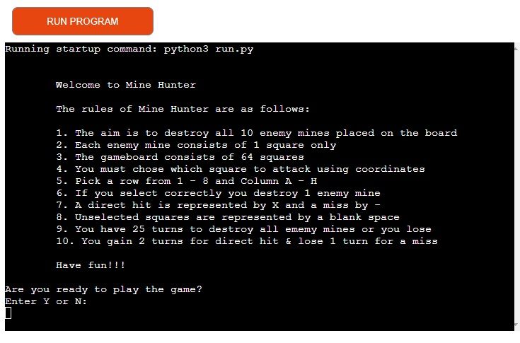
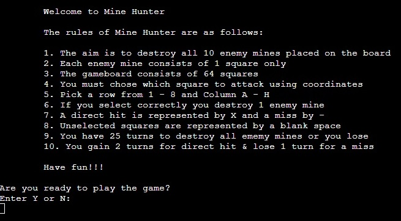
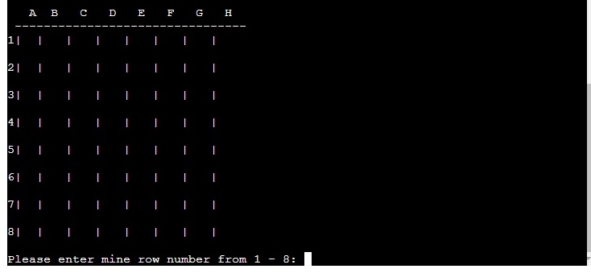
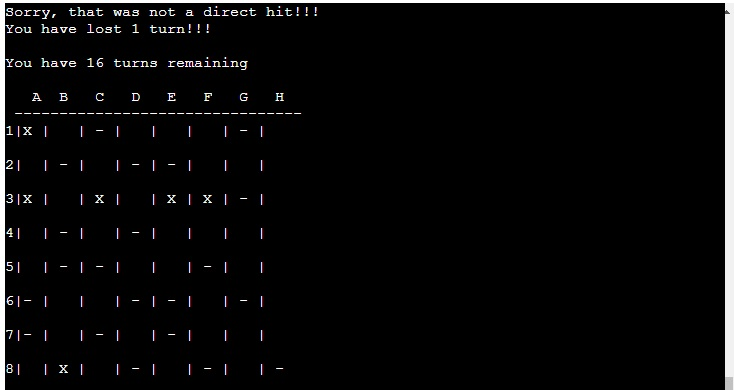
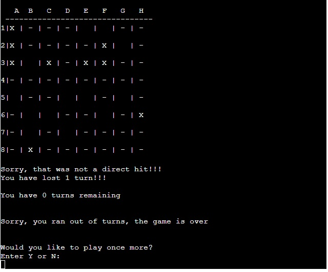
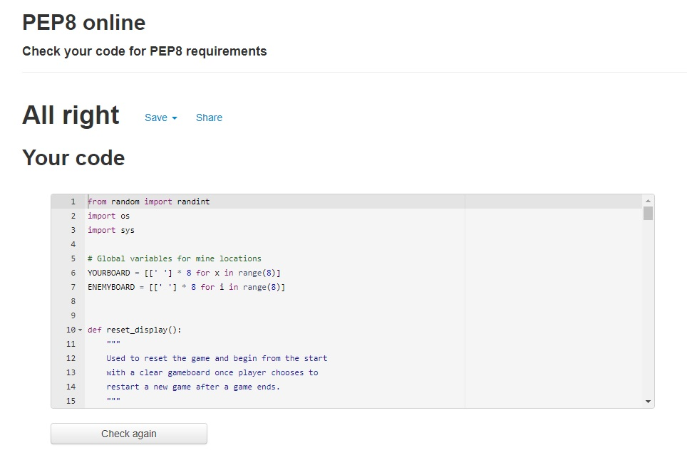

# Mine Hunter

Mine Hunter is a fun and interactive single player game which can be played in the Code Institute mock python terminal. This game is a mixture between traditional favourites Minesweeper and Battleship where the aim of the game is to locate and destroy all enemy mines before it is too late!!!

## The Game

 

 

This game is hosted by Heroku and can be played at:
 
[Mine Hunter](https://minehunter-sc.herokuapp.com/)

## **Contents**

## **How To Play**

*   Read the game instructions carefully
*   If player is happy to proceed press Y or Press N if more time is needed
*   Once started the player is now the Mine Hunter
*   The Mine Hunter is presented with a gameboard of 8 x 8 squares (64 squares total)
*   There are 10 mines hidden on the gameboard and the Mine Hunter must destroy all mines in order to win the game
*   Mine locations can be guessed by their co-ordinates (1-8 for the rows and A-H for the columns). All mines are placed randomly every time a new game is started.
*   The Mine Hunter has 25 turns in order to destroy all mines and win
*   Unselected squares are marked with an empty space
*   If a correct location is chosen the mine will be destroyed and will be replaced by an X. The Mine Hunter will also gain 2 extra turns.
*   If incorrect guess is made a - symbol will mark that location. 1 turn will be lost every time this happens.
*   If all 10 mines are destroyed before turns run out then the Mine Hunter will win the game otherwise it will be a loss.
*   At the end of the game an option will be presented to play again. Press Y to play again or press N to end that game session.

## **The Planning And Design Process**

### User Stories:

*   As a player I want to be able to understand the games purpose instantly upon loading it.
*   As a player I want to be able to understand how the game functions from the outset.
*   As a player I want to be able to play an enjoyable and challenging game.
*   As a player I want to be able to track my progress as the game goes on.
*   As a player I want to be able to restart the game again easily once one game ends.

### Game Aims:

This game aims to:

1.   Make it clear what the game is about without the need for further explanation from external sources.
2.   Communicate a clear and appropriate response to all player inputs.
3.   Continue in a loop without any errors or without ever crashing after a players input.
4.   Allow the player to have an enjoyable experience playing Mine Hunter by themselves.

### How This Will Be Achieved:

1.   The player is presented with a welcome screen straight after loading where they have an opportunity to read the game instructions and instantly gain an understanding as to what the game is about.
2.  Ensure that all user input provide an appropriate response.
3.  Any unexpected player input will show a message to inform the player that their entry was invalid and guide them on how to input as expected.
4.  Executing all of the above successfully to ensure a very enjoyable experience.

### Game Flow Chart:

[Back To Contents](<#contents>)

## **Features**

### Existing Features:

####  Mine Hunter Welcome Screen:

This is the screen that the player will be presented with first when they access the terminal. It welcomes the player and gives them a number of very clear and concise instructions about how to play the game and what it will take to win. From here the player can decide if they wish to proceed with the game and they can do so by pressing Y.

 

#### The Gameboard:

The Mine Hunter will now be presented with a blank gameboard. They will be a able to view 64 empty square spaces. There are 10 mines placed randomly amongst these spaces. Rows are marked vertically via numbers 1-8 and columns are marked horizontally via letters A-H.

 

#### The Game Starts: 

Mine locations can be guessed via the above co-ordinates. The Mine Hunter is first asked to guess a row number 1-8 and secondly a column letter A-H. Numbers and letters outside of these ranges will not be accepted and will result in a message stating this. You also cannot guess the same square twice. After guessing they will notified via on screen text if they were successful and have a made a direct hit. They will be presented with one the following statements:

*   Well Done, that is a direct hit!!!
    You have gained 2 turns!!!

*   Sorry, that was not a direct hit!!!
    You have lost 1 turn!!!

A direct hit will result in a mine being destroyed and will be marked by an X. An unsuccesful attempt will br marked by an - symbol.

How many turns the Mine Hunter has remaining will always be displayed above the gameboard.

 

#### The End Game:

There are two possible outcomes of this game:

*   The Mine Hunter has guessed all 10 mine locations. The mines have been destroyed and they are victorious. If this happens the message below will be displayed:

Congratulations, you have destroyed all mines!!!')
You are the winner!!!

*   The Mine Hunter has not been successful with their guesses. All the mines have not be destroyed and all turns have run out resulting in defeat.

You Have 0 turns remaining
Sorry, you ran out of turns, the game is over.

* Regardless of the game outcome the Mine Hunter will be presented with an opportunity to restart the game via the Y or N option. Pressing Y will restart and return to the welcome screen and pressing N will end the game session.

 

### Future Features:

*   Create an option for the Mine Hunter to create a username before the beginning of gameplay.

*   Include a timer to test how quickly the Mine Hunter can destroy all the mines.

*   Create a leaderboard to include the above usernames and score times. This would all allow for a much more enjoyable experience as the Mine Hunter would keep returning to play and beat their previous scores.

*   Create a multiplayer mode where 2 or more players can play at once on numerous game boards and the fastest to clear all mines would win.

*   Improve the games visuals. Add images and color to the gameboard/ text thus making the gameplay much more aesthetically pleasing.

*   Add audio and/ or sound effects for direct hits and misses.

 

[Back To Contents](<#contents>)

## **Data Model**

 

[Back To Contents](<#contents>)

## **Technologies Used**

*   [Python](https://docs.python.org/3/library/) - Programming language used to build the game.
*   [Heroku](https://www.heroku.com/) - This was used to deploy the finished game.
*   [Github](https://github.com/) - This was used to store, track and manage the Git repository for the game.
*   [Gitpod](https://www.gitpod.io/) - Provided the development environment for the game.

 

[Back To Contents](<#contents>)

## **Testing**

During the development process this game was continually tested in the local terminal and also in the Code Institute Heroku terminal. This was done to ensure that it was always functioning as expected and also to ensure that any issues could be resolved easily and staright away.

### Code Validation:

*   The Python code from this game has been validated using [PEP8 Online](http://pep8online.com/) to ensure that it complies with the all relevant standards. run.py was tested using this and has come back 100% clear from all errors (see image below).

 

### Testing User Stories:

*   As a player I want to be able to **understand** the games **purpose instantly** upon loading it.
    * Instantantly **upon loading** it is very obvious to the player what the game is as the **heading Mine Hunter** is the first thing they will see.
*   As a player I want to be able to **understand** how the game **functions** from the **outset**.
    * The first thing the player is presented with **upon loading** is a set of very **clear and concise instructions** as to how the game operates and what is takes to be successful.
*   As a player I want to be able to play an enjoyable and challenging game.
    * Once the game begins the player is presented with a **fun interactive game** that is very challenging. **Success** in this game is **not easily achieved** and will result in the **player coming back** time and time again as they strive to be succefful.
*   As a player I want to be able to **track my progress** as the game goes on.
    * At all times the **number of turns** the player has left is **visible**. They start with 25 turns, they gain 2 turns for every direct hit and lose 1 for every miss. This is **updated at every attempt**.
*   As a player I want to be able to **restart** the game again **easily once one game ends**.
    * Once the game ends the player is told if they are victorious or not. Straight away they are then given the **option to restart** the game regardless of the previous result.

### Known Bugs:

*   Resolved Bugs

1.  One problem that arose during the development process was when a game ended and the option was then presented to the player to play again. The player is asked to press Y to play again or N to end the session. If they pressed N everything worked as expected however a number of problems arose when Y was selected. The game should start again but two errors were acourring. 1) Instead of a new blank gameboard appearing, a new game was starting and the previous gameboard appeared which still kept all the X and - selections. This meant that the player was continuing the previous game (with 25 new turns) rather than starting a new one. 2) A new board was not appearing at all and the player was just asked to enter a continuous amount of co-ordinates without a new game beginning.

    This problem was being caused because when the player choose Y to restart the game again, the previous game was not reseting itself back to the beginning. It was merely bringing the player back to the start game and just trying to continue the previous game. A solution had to be found to restart everything and revert back to the welcome screen. This was solved by importing the os module and creating a reset_display function and running the following code:

    - python = sys.executable
    - os.execl(python, python, *sys.argv)

    Now when the player selects Y, a new game will begin from the welcome screen with a new gamebaord.

*   Unresolved Bugs

During development there was a number of bugs found that have remained unresolved. All of these issues would be resolved with more time working on this game. They were as follows:

1.  When a new game begins you are firstly presented with the welcome screen and game rules. Pressing Y should then always proceed directly to a blank gameboard. Sometimes the player is asked to enter co-ordinates before the gameboard appears. This should not happen and the gameboard should always appear before any co-ordinates are requested from the player.

2.  When entering co-ordinates, the player is asked to enter 1-8 for a row and A-H for a column. Entering an invalid number or letter will result in a notification appearing stating that. However if the player hits enter with just a blank space (and neither a letter or number) then the game will crash. The player will have to hit run program to begin game again.

3.  The game ends when the player either destroys all mines or runs out of turns. When either result happens, the last player choice (either X or -) does not show up on the gameboard. The game will announce the result but the last selection is not shown.

 

[Back To Contents](<#contents>)

## **Deployment**

### Heroku:

This game was deployed using Heroku and it can be viewed below:  
[Mine Hunter](https://minehunter-sc.herokuapp.com/)

In order to deploy this game a number of steps had to be undertaken;

1.  Push most up-to-date code to GitHub
2.  If necessary, make sure the requirements for the project are added to the requirements.txt file prior to deployment.
3.  Naviagte to [Heroku](https://id.heroku.com/login)
4.  Either login or create new account if using heroku for the first time
5.  From the Heroku dashboard, click create new app
6.  Create a new unique name for your app, select your region and click create app
7.  A new heroku app has now been created. You are then presented with a number of tabs at the time of the screen. Select the settings tab. Its very important that this selection is selected before proceeding to deployment
8.  Naviagte to Config Vars section and click reveal config vars button
9.  Add new config var: key = PORT and value = 8000
10. Navigate to the Buildpacks section and click on Add Buildpack, select Python and save changes
11. Click on Add Buildpack once again and select node.js. Save changes
12. Once selected make sure Python is listed above node.js in the dashboard
13. Naviagte once again to the top of the screen and select the Deploy tab
14. In the deployment method section, select GitHub and confirm the connection.
15. Once the app is connected to GitHub, search for the repository name and click connect.
16. Scroll to bottom of screen and if desired you can choose to enable automatic deploys. This will ensure the app is updated every time code is pushed to GitHub. You can also choose to manually deploy if preferred.
17. The app will now be successfully deployed.
18. To view the app after deployment, naviagte to the Heroku app dashboard and click on the open app button in the top right corner. A live version of the deployed app will now open.

### To Fork A Repository On GitHub:

A fork is a copy of a repository. Forking a repository allows you to freely experiment with changes without affecting the original project. In order to fork this repository follow the steps below;

1. Log into your GitHub account and locate the repository your wish to fork.
2. On the top right corner of the repository page locate the "Fork" option.
3. Click this button and a copy of the original repository will now be created in your GitHub account.

### Creating A Local Clone of Game Files From GitHub:

1. Log into your GitHub account and locate the repository you wish to clone.
2. When in the repository, click on the "code" tab.
3. When the menu opens; select HTTPS and copy the link on right side.
4. Naviagte to an IDE and open GIT bash.
5. Change the current working directory to the location where you want the cloned directory to be made.
6. Type "git clone"
7. Paste the URL of the code you have copied from GitHub,
8. Press enter and your local clone will have been created.

 

[Back To Contents](<#contents>)

## **Credits**

### Game Content:

*   All text content used in this game is owned by the developer.
*   Code Institute provided the Python essentials template used in the development process of this game and they also provided the mock terminal used for its displaya and gameplay.

### Code:

* While working on the Python code for this game there were a number of tutorials studied which detailed the development process of Minesweeper and Battleship games. Inspiration for my code was taken from the tutorials below and where used was edited to suit this games requirements.

    * Title: [Python Game Tutorial: Minesweeper Basic Game Functions](https://www.youtube.com/watch?v=XTT8mXwIGpQ), Date: 2021, Author: TokyoEdtech.
    * Title: [How to Code Battleship in Python - Single Player Game](https://www.youtube.com/watch?v=tF1WRCrd_HQ), Date: 2021, Author: Knowledge Mavens.
    * Title: [Python For Beginners: Battleship](https://bigmonty12.github.io/battleship), Date: 2020, Author: Austin Montgomery.

## **Acknowledgements**

This game was completed as part of Code Institute's Diploma in Full Stack Software Development program and was completed in May 2022. I wish to thank my mentor Spencer Barriball for all the time and effort given to me during the time spent on this project. I also wish to acknowledge the slack community and all those at Code Institute for all their help and support.

Shane Coen, 2022.

 

[Back To Contents](<#contents>)